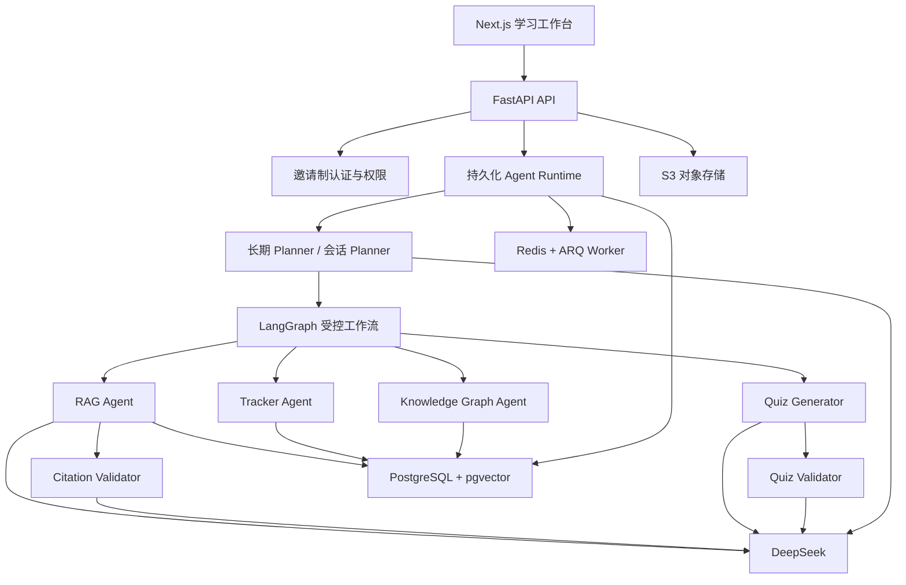

# 期末复习 Agent V2 优化实施计划

> 状态：阶段 0 已完成；阶段 1 的 Task 1.1、Task 1.2、Task 1.3 已验收；Task 1.4 已完成实现，等待阶段 1 验收。
>
> 基线：`main` 分支，提交 `23c17b5`。
>
> 执行原则：本文档可以由 Codex 或 Claude 按任务逐项执行。任何业务代码修改都必须在用户确认本计划后开始。

## 1. 目标

把当前单用户原型升级为面向 5～20 位受邀同学、约 3 人同时活跃的云端复习系统，并将“可解释的多 Agent 协作”作为主要技术亮点。

V2 必须形成以下闭环：

1. 用户创建多门私人课程，上传资料并设置考试日期与复习目标。
2. 系统解析资料、构建可追溯的检索索引与可编辑知识图谱。
3. 长期 Planner 跨课程分配每日复习时间，会话 Planner 拆分当前学习任务。
4. 用户确认计划后，受控 LangGraph 工作流调用专业 Agent 执行。
5. Ask 回答的关键结论必须绑定并校验证据；资料不足时先澄清。
6. Quiz 生成多组候选选择题，经 Validator 评分后选优；答案只保存在后端。
7. Tracker 根据答题、用时、信心、错误类型和间隔保持情况更新掌握度。
8. SM-2 安排今日复习，新的结果再反馈给 Planner 重新规划。

## 2. 已确认的产品约束

| 主题 | 决策 |
|---|---|
| 产品目标 | 同时作为求职作品和真实复习工具 |
| 用户范围 | 5～20 位受邀同学；约 3 人同时活跃 |
| 发布路径 | 先完成可靠本地版本，再部署云端 |
| 核心能力 | Ask、Quiz、Review 必须形成完整闭环 |
| 技术亮点 | Planner 驱动的多 Agent 协作 |
| 执行模式 | 用户确认计划后自动执行本次复习流程 |
| Agent 可见性 | 用户只看简洁、真实的执行状态；详细轨迹供调试 |
| LLM | DeepSeek 为唯一对话模型；失败时重试，不做多 Provider 降级 |
| 数据库 | PostgreSQL + pgvector |
| 原始文件 | S3 兼容对象存储 |
| 身份 | 邀请码 + 用户名/密码；每位用户数据完全隔离 |
| 管理后台 | 邀请码、用户禁用、任务队列监控 |
| 课程 | 每人可维护多门私人课程，不共享资料 |
| 计划 | 跨课程长期计划 + 当前会话计划；支持时间预算和临时调整 |
| RAG 边界 | 资料不足时澄清；联网搜索仅在用户明确授权后启用 |
| 引用标准 | 关键结论绑定证据片段，并校验支持关系 |
| 题型 | 第一阶段只支持选择题 |
| 出题质量 | 多候选生成 + Validator 评分选优 |
| 评分安全 | 正确答案仅存后端，由后端评分 |
| 测验模式 | 练习模式即时反馈；模拟考试结束后统一反馈 |
| 自适应 | 知识点掌握度驱动难度；复习调度使用 SM-2 |
| 知识结构 | 可编辑知识图谱，后台增量更新并保留版本 |
| 记忆 | 用户可查看、修正和删除跨会话学习记忆 |
| 文件支持 | 仅文本型 PDF、DOCX、PPTX；每人约 100 个文件、2 GB |
| 资料任务 | 后台队列、进度、取消、重试、优先级和管理监控 |
| 长任务 | 页面关闭后继续；可恢复、可取消、可查看结果 |
| 流式体验 | Agent 步骤事件 + DeepSeek 真实 Token 流 |
| 执行轨迹 | 保存结构化输入/输出/工具结果；默认 30 天，可配置 |
| 删除能力 | 支持单项删除和账号全量删除 |
| 前端 | 保留现有风格和无需改动页面；新增界面延续同一设计语言 |
| 设备 | 电脑和手机完整支持所有核心流程 |
| 自动化 | 测试、格式、类型、安全扫描和容器构建进入 GitHub Actions |
| 展示材料 | 中文技术文档、架构图、在线演示账号和演示脚本 |
| 历史数据 | 不迁移当前 SQLite/Chroma 数据，从空数据库开始 |
| 实施方式 | 允许重构数据层和 Agent 层，尽量保持现有前端 API 兼容 |

## 3. 明确非目标

以下内容不进入 V2 主路线，除非后续重新审批：

- 扫描 PDF OCR、图片、公式、表格和图表识别。
- 填空题、简答题、计算题和论述题。
- 课程资料共享或协作编辑。
- 邮件、浏览器推送、PWA 和离线模式。
- 中英文国际化。
- 自动联网搜索或把通用知识悄悄混入资料回答。
- 多 LLM Provider、Agent 辩论和无上限自主循环。
- BKT、IRT、FSRS 等需要更大数据量的学习算法。
- 为 50 人以上并发提前建设 Kubernetes 或微服务集群。
- 全面重做现有视觉设计。

## 4. 当前基线与必须解决的问题

### 4.1 数据闭环不一致

- 会话和资料元数据进入 SQLite，但错题保存在进程内 `DictStore`。
- 当前测验保存在前端 Zustand；刷新后丢失。
- SQLAlchemy 已定义 `QuizSession`、`AnswerRecord` 和 `MistakeRecord`，API 却没有使用。
- 所有业务固定使用 `user_id="default"`，认证依赖没有接入路由。

### 4.2 RAG 表面为混合检索，实际状态不可持续

- Chroma 中的 Dense 向量可以持久化。
- BM25 索引只存在于单个 `RetrievalService` 实例，新请求无法复用上传时建立的索引。
- Citation 依赖模型输出特定文本格式后再用正则提取，没有验证证据是否支持结论。
- Quiz Prompt 没有向模型提供可靠的真实 chunk ID，来源链容易失真。

### 4.3 Agent 编排仍是规则分发

- LangGraph 目前只按关键词在 QA、Quiz、Review 之间路由。
- 没有持久化 Agent Run、步骤状态、计划审批、失败恢复或重规划。
- 学习画像更新、会话摘要、PaperAnalyzer 和 MistakeSummarizer 等能力没有接入主流程。

### 4.4 异步与流式能力不完整

- 上传接口内联执行解析、Embedding 和索引；ARQ Worker 只有骨架。
- `reprocess` 只修改状态，没有真正重新入队。
- Chat 先等待完整 LLM 响应，再逐字符发送，属于伪流式。
- 页面断开后没有可靠的 Run 恢复协议。

### 4.5 工程基线存在缺口

- 新环境的数据库迁移步骤不完整，依赖声明和启动文档需要校正。
- 当前 E2E 仍断言旧标题，完整测试套件存在慢或挂起问题。
- Health Check 只返回配置值，没有检查数据库、对象存储、队列和模型可用性。

## 5. 目标架构

部署形态采用“模块化单体 + 独立后台 Worker”，不拆微服务。FastAPI API 与 ARQ Worker 共享同一后端代码、领域模型和数据库，使用不同启动命令。PostgreSQL 是业务数据、Job、Agent Run 和事件的事实源；Redis 只承担队列、锁和短期通知，不能成为唯一状态来源。



### 5.1 Agent 与普通服务的边界

只把需要模型判断、规划或内容生成的组件称为 Agent：

| 组件 | 职责 | 是否调用 LLM |
|---|---|---|
| Global Planner | 跨课程分配长期复习时间 | 是 |
| Session Planner | 把当前目标拆成可执行任务 | 是 |
| RAG Agent | 基于证据回答、发现信息不足 | 是 |
| Citation Validator | 校验关键结论与证据支持关系 | 是 |
| Quiz Generator | 生成多组选择题候选 | 是 |
| Quiz Validator | 评分、淘汰和排序候选题 | 是 |
| Tracker Agent | 归因错误类型、解释学习状态变化 | 是 |
| Knowledge Graph Agent | 增量提取章节、知识点和依赖候选 | 是 |
| Retrieval Service | 混合检索、过滤、融合和重排 | 否 |
| Scoring Service | 服务端确定性选择题评分 | 否 |
| Mastery Service | 掌握度规则计算 | 否 |
| SM-2 Scheduler | 计算下次复习时间 | 否 |
| Auth / Storage / Quota | 权限、文件和配额 | 否 |

禁止为了展示“多 Agent”把确定性算法包装成 LLM Agent。

### 5.2 关键工作流

#### Ask

`Session Planner -> Retrieval -> RAG Agent -> Citation Validator -> 真流式回答`

- 检索不足：返回澄清问题，不进入无依据回答。
- Validator 不通过：允许一次定向修订；再次失败则返回证据不足。
- 所有引用使用结构化 Evidence ID，不从回答字符串反向猜测。

#### Quiz

`Session Planner -> Retrieval -> Quiz Generator(N 组) -> Quiz Validator -> 持久化 QuizSession`

- 前端永远不接收 `correct_answer`。
- Validator 检查答案唯一性、证据覆盖、干扰项质量和目标难度。
- 练习模式逐题反馈；模拟考试结束后统一反馈。

#### Review

`后端评分 -> Tracker -> Mastery Service -> SM-2 -> Planner 重规划`

- LLM 负责错误类型与语义标签，分数和间隔由确定性服务计算。
- 每次状态变化保留原因、输入信号和算法版本，保证可解释。

## 6. 数据与接口设计原则

### 6.1 核心数据实体

建议按以下实体重整现有 SQLAlchemy 模型：

- 身份：`User`、`InviteCode`、`RefreshToken`、`UserQuota`。
- 课程：`Course`、`Exam`、`StudyAvailability`。
- 资料：`Material`、`MaterialChunk`、`MaterialJob`。
- 对话：`Conversation`、`ConversationMessage`、`LearningMemory`。
- Agent：`AgentRun`、`AgentStep`、`AgentEvent`、`Plan`、`PlanTask`。
- 知识：`KnowledgeNode`、`KnowledgeEdge`、`KnowledgeGraphVersion`、`KnowledgeChange`。
- 测验：`QuizSession`、`Question`、`QuestionEvidence`、`AnswerRecord`。
- 学习：`MistakeRecord`、`ConceptMastery`、`ReviewEvent`、`ReviewSchedule`。

所有用户数据表必须直接或通过不可绕过的父实体关联 `user_id`。Repository 查询不得接受来自客户端的任意 `user_id`。

可演进的任务和 Agent 状态优先使用字符串列加数据库 `CHECK` 约束，不继续扩大 PostgreSQL Enum。稳定关系字段规范化，JSONB 仅用于可选扩展元数据。

### 6.2 pgvector 与混合检索

- `MaterialChunk` 在 PostgreSQL 保存正文、定位信息、内容哈希、Embedding 和预分词文本。
- Dense Retrieval 使用 pgvector；Lexical Retrieval 使用持久化的中文预分词字段和 PostgreSQL 全文检索。
- 在应用层执行 RRF 融合，再进行 Cross-Encoder 重排和质量门控。
- Embedding/Reranker 必须保持可替换接口，并在免费云环境做内存与冷启动基准。
- 若本地模型无法满足免费资源限制，允许仅替换 Embedding/Reranker Provider；DeepSeek 仍是唯一对话 LLM。

### 6.3 Agent Run 与事件协议

统一事件至少包含：

```text
run.created
plan.proposed
plan.approved
step.started
step.progress
step.completed
step.failed
token.delta
run.completed
run.failed
run.cancelled
```

每个事件包含 `run_id`、`step_id`、单调递增序号、时间、公开 payload 和内部 trace 引用。前端使用 `Last-Event-ID` 或等价游标恢复事件，不依赖单个 HTTP 连接一直存活。

### 6.4 API 兼容策略

- 优先保留现有 `/api/chat`、`/api/materials`、`/api/quiz`、`/api/review` 入口。
- 在响应 Envelope 内增量增加 `run_id`、状态和分页字段。
- 先增加新接口，再迁移前端，最后删除旧字段；每次删除必须有契约测试。
- 所有受保护 API 从认证上下文读取用户，不再使用 `default`。

## 7. 分阶段实施路线图

阶段按依赖顺序执行，不按固定日期执行。每一阶段必须通过验收门才能开始下一阶段。

每个阶段都必须同时交付让当前功能继续可用的最薄前端适配和契约测试。阶段 7 是前端整体收束与移动端验收，不代表前六个阶段可以只改后端而留下长期断裂的 UI。

| 阶段 | 交付结果 | 复杂度 |
|---|---|---|
| 0 | 可复现基线与架构契约 | 中 |
| 1 | 多用户 PostgreSQL 持久化底座 | 高 |
| 2 | 对象存储与可靠资料任务流水线 | 高 |
| 3 | 可评测、可校验的 RAG | 高 |
| 4 | 持久化 Planner + Agent Runtime | 很高 |
| 5 | 安全测验、自适应掌握度与 SM-2 | 很高 |
| 6 | 知识图谱、记忆与跨课程规划 | 很高 |
| 7 | 新增前端与完整移动端适配 | 高 |
| 8 | 评测、安全、CI 和可观测性 | 高 |
| 9 | 免费优先部署与作品集交付 | 中 |

---

## 阶段 0：建立可复现基线

### Task 0.1：修复开发与测试基线

**主要文件**

- 修改：`backend/pyproject.toml`
- 修改：`backend/.env.example`
- 修改：`README.md`
- 修改：`frontend/package.json`
- 修改：`frontend/e2e/smoke.spec.ts`
- 新建：`compose.yaml`

**工作项**

- [x] 补齐直接依赖、迁移命令和一键启动说明。
- [x] 明确 Python、Node、PostgreSQL、Redis 和对象存储的版本范围。
- [x] 定位完整 pytest 超时原因，删除网络下载和真实大模型初始化对单元测试的影响。
- [x] 修复过期 E2E 断言，建立当前 UI 基线。
- [x] 提供开发、测试两套隔离配置，测试不得读真实 API Key。

**验收**

- [x] 新环境按 README 可以安装项目、创建数据库、执行迁移和构建前后端。
- [x] 后端完整测试、前端单测和 E2E Smoke 均有确定结果，不允许无日志超时。
- [x] 工作区无测试生成的未跟踪业务文件。

### Task 0.2：冻结 V2 契约与 ADR

**建议新建**

- `docs/architecture/adr/0001-postgres-pgvector.md`
- `docs/architecture/adr/0002-agent-runtime.md`
- `docs/architecture/adr/0003-object-storage.md`
- `docs/architecture/adr/0004-auth-and-tenancy.md`
- `docs/architecture/api-contracts.md`

**工作项**

- [x] 记录 Agent 与普通服务边界、失败策略和停止条件。
- [x] 定义统一 API Envelope、错误码、Agent Event 和分页契约。
- [x] 定义用户隔离规则、删除语义和 30 天 Trace 保留策略。
- [x] 为 DeepSeek、Embedding 和 Reranker 定义接口，不在业务层直接实例化客户端。
- [x] 建立基础 CI：后端快速测试、前端单测、类型检查和构建；真实模型评测不得进入普通提交流水线。

**阶段 0 验收门**

- [x] 全部现有行为有可重复的自动化基线，已跳过项明确标注需要真实模型服务。
- [x] 后续 AI 编程任务可以引用稳定的数据与事件契约。

**完成记录（2026-08-03）**

- 后端：`182 passed, 2 skipped`，无真实模型下载和数据库连接线程警告。
- 前端：`81 passed`；格式、ESLint、TypeScript、覆盖率和生产构建通过。
- E2E：Chromium Smoke `4 passed`，使用固定 API 响应，不要求真实后端或 DeepSeek Key。
- 工程：可编辑安装、空 SQLite 迁移、Compose 配置和 Bandit 中高等级门通过。

---

## 阶段 1：多用户 PostgreSQL 持久化底座

### Task 1.1：切换 PostgreSQL + pgvector

**主要文件**

- 修改：`backend/app/core/config.py`
- 修改：`backend/app/db/database.py`
- 重构：`backend/app/db/models.py`
- 新建：Alembic V2 初始迁移
- 测试：`backend/tests/test_database_config.py`、`backend/tests/test_db_models.py`

**工作项**

- [x] 从空数据库建立 V2 Schema，不迁移 SQLite 数据。
- [x] 启用 pgvector Extension，给租户、状态和调度查询建立索引；课程索引随 Task 1.3 的课程实体添加。
- [x] 删除 `DictStore` 在生产路径中的使用；测试使用注入的 Repository 替身或 SQLite 隔离库。
- [x] 建立 Repository/Service 边界，错题 API 和 Tracker 不直接操作 ORM。
- [x] 增加 `/health/live` 和 `/health/ready`；前者只检查进程，后者检查 PostgreSQL 与 Redis。

**完成记录（2026-08-03）**

- 后端完整回归：`204 passed, 2 skipped`；应用语句覆盖率约 `80.45%`，新错题 Repository 模块覆盖率 `95%`。
- PostgreSQL 离线迁移：V2 初始迁移 upgrade/downgrade SQL 均可生成，包含 pgvector、JSONB、HNSW、GIN 和带时区时间列。
- 工程检查：`compileall`、`git diff --check`、Compose 配置、`pip check` 和 Bandit 中高等级门通过。
- Task 1.2 验收补充：已在 Docker Engine 29.6.2 的 PostgreSQL 17.8 + pgvector 0.8.1 实例完成在线 upgrade/downgrade/upgrade 往返，最终 head 为 `20260804_0002`。

### Task 1.2：邀请码认证和会话安全

**建议文件**

- 新建：`backend/app/api/auth.py`
- 新建：`backend/app/schemas/auth.py`
- 新建：`backend/app/services/auth_service.py`
- 重构：`backend/app/core/auth.py`
- 新建：`frontend/src/app/(auth)/login/page.tsx`
- 新建：`frontend/src/app/(auth)/register/page.tsx`

**工作项**

- [x] 管理员生成一次性或限次邀请码。
- [x] 使用 Argon2id 保存密码；短期 Access Token + 可撤销 Refresh Token。
- [x] Web 端优先使用安全、HttpOnly、SameSite Cookie，不把长期令牌放入 localStorage。
- [x] 登录、刷新、退出、禁用账号和限速均有测试。
- [x] 将所有现有 API 的 `default` 替换为认证用户上下文。

**完成记录（2026-08-04）**

- 后端实现邀请码约束、用户名/密码认证、管理员角色、账号禁用、JWT Access Token、Refresh Token 哈希存储/轮换/会话撤销、CSRF 绑定、认证限速和租户过滤。
- 前端新增 `/login`、`/register`、会话恢复门和统一 Cookie/CSRF API 封装，保持现有学习工作台设计语言。
- 自动化验证：后端（包含真实 PostgreSQL RLS）`245 passed, 2 skipped`、综合覆盖率 `80%`；前端覆盖测试 `101 passed`、语句覆盖率 `80.05%`、行覆盖率 `81.26%`；Playwright E2E `6 passed`。前端格式、ESLint、TypeScript、生产构建及桌面/手机视觉溢出检查通过。
- 修复验收复审发现的 RLS 跨事务上下文丢失、LangGraph 独立 Session 未绑定、Access Token 过期不续期、Argon2 阻塞事件循环、SSE 异常细节泄露和缺少退出入口；新增对应回归测试。`npm audit` 与生产依赖审计均为 0 漏洞。
- PostgreSQL 使用 bootstrap 管理员创建 `NOSUPERUSER NOBYPASSRLS` 应用角色；该角色已完成在线 migration 往返、`FORCE ROW LEVEL SECURITY` 跨 commit 隔离、越权写拒绝、SessionFactory 绑定和 `/health/ready` 联调。

### Task 1.3：私人多课程领域模型

**建议文件**

- 新建：`backend/app/api/courses.py`
- 新建：`backend/app/schemas/courses.py`
- 新建：`backend/app/services/course_service.py`
- 修改：资料、会话、测验和复习模型的课程归属

**工作项**

- [x] 支持课程、考试日期、长期目标和每日可用时间。
- [x] 支持每次会话临时覆盖可用时长。
- [x] 所有资料、会话、图谱、测验和掌握度必须属于一个私人课程。
- [x] 添加跨用户访问负面测试，包括猜测 ID、批量接口和删除接口。

**完成记录（2026-08-05）**

- 新增私人课程 CRUD、批量 ID 查询、默认课程兼容，以及考试日期、长期目标、每日可用时长和会话临时覆盖；默认课程切换、删除后替代和懒创建均保持事务一致性。
- 资料、资料块、会话、消息、测验、题目、答题、错题、学习画像、知识图谱与掌握度均携带非空课程范围；Ask、Quiz、Review、Memory、Study Plan、Chroma 和 BM25 调用链传播同一用户/课程上下文。
- PostgreSQL 使用复合所有权外键、敏感子表 `FORCE RLS` 和“每用户最多一个默认课程”的部分唯一索引；真实并发测试验证两个 Session 懒创建默认课程时返回同一课程。
- 后端完整回归 `266 passed, 5 skipped`，综合覆盖率 `80.05%`；真实 PostgreSQL 集成测试 `3 passed`。迁移从空库在线升级、离线 SQL、`alembic check`、有数据 downgrade 和旧全局概念数据保护均已验证。

### Task 1.4：用户数据删除与配额

- [x] 支持删除会话、资料、测验、错题和记忆。
- [x] 账号注销创建可追踪删除任务，清理关系数据、对象和向量。
- [x] 默认限制每用户 100 个文件、2 GiB；管理员可调整。
- [x] 删除失败可重试，最终状态对用户可见。

**完成记录（2026-08-05）**

- 新增资料、测验、错题和课程记忆删除，并沿用已有会话删除；所有资源继续按认证用户和课程隔离，跨租户删除返回 `404`。
- 账号注销先锁定并禁用用户、撤销 Refresh Token、禁用其创建的邀请码，再创建只保存状态令牌哈希的 `pending` 删除任务；API 先返回明文状态令牌，响应发送后由独立数据库 Session 清理 PostgreSQL 业务数据、本地文件与 Chroma collection，失败或中断后可通过令牌查询和重试，成功后保留脱敏任务记录。
- 上传采用持久化 `pending` Material 预留、流式写入和用户行锁；配额与注销共享同一锁，失败会清理预留和文件。默认限制为 100 个文件、2 GiB，管理员可按用户覆盖。
- 后端完整回归 `285 passed, 8 skipped`，综合覆盖率 `80.23%`；真实 PostgreSQL + RLS `6 passed`。Task 定向 Ruff、Bandit 中高危、`compileall`、`pip check`、Compose 配置与 `git diff --check` 均通过。
- PostgreSQL 在线迁移 `0004 -> 0003 -> 0004` 往返通过，最终为 `20260805_0004 (head)`；`alembic check` 无漂移，测试探针清理后用户、课程、资料、删除任务、邀请码和 Refresh Token 均为 0。
- 安全复审无阻断项。保留两项后续产品加固：永久注销增加近期密码/step-up authentication；为提交任务后、明文状态令牌返回前的进程崩溃或响应丢失提供用户自助恢复通道。

**阶段 1 验收门**

- 两个用户上传同名文件、创建同 ID 范围资源时完全隔离。
- 服务重启后会话、测验和错题不丢失。
- 被禁用用户无法刷新会话或访问已有资源。
- 账号删除测试证明数据库、对象和向量没有残留。

---

## 阶段 2：对象存储与可靠资料任务流水线

### Task 2.1：S3 对象存储抽象

**建议文件**

- 新建：`backend/app/services/object_storage.py`
- 修改：`backend/app/api/materials.py`
- 修改：`backend/app/db/models.py`
- 测试：`backend/tests/test_services/test_object_storage.py`

**工作项**

- [ ] 上传前验证扩展名、MIME、Magic Bytes、大小和压缩包安全边界。
- [ ] 对象 Key 由服务端生成，禁止使用用户文件名构造路径。
- [ ] 使用内容哈希识别完全重复文件，并定义替换/保留策略。
- [ ] 下载与预览使用短期签名 URL，不暴露存储凭证。

### Task 2.2：ARQ 任务状态机

**主要文件**

- 重构：`backend/app/tasks/worker.py`
- 重构：`backend/app/tasks/parse_material.py`
- 新建：`backend/app/services/job_service.py`
- 新建：`backend/app/api/admin.py`

**状态**

`queued -> running -> succeeded | failed | cancelled`

**工作项**

- [ ] 上传 API 只保存对象和任务，立即返回 `queued`。
- [ ] Worker 执行下载、解析、切片、Embedding、索引和图谱增量任务。
- [ ] 每一步持久化进度、尝试次数、错误码和安全的错误摘要。
- [ ] 支持取消、指数退避重试、用户重新处理和管理员优先级调整。
- [ ] 使用幂等 Key，重复投递不得重复写 chunk 或扣配额。
- [ ] PostgreSQL Job 是事实源；增加恢复扫描器，补投“数据库已提交但 Redis 入队失败”或 Worker 中断的任务。

### Task 2.3：解析与切片质量

- [ ] 保持 PDF、DOCX、PPTX 文本解析，不加入 OCR。
- [ ] 统一页码、幻灯片、章节标题、父子 chunk 和字符范围元数据。
- [ ] 将字符数伪装的 `token_count` 改成真实 Token 或明确命名为 `char_count`。
- [ ] 建立中文教材、讲义和 PPT 固定 Fixture，验证结构定位。

### Task 2.4：免费资源基准

- [ ] 比较至少一个轻量本地 Embedding 配置和一个可插拔远程配置。
- [ ] 记录模型大小、首次加载、单页吞吐、峰值内存和检索效果。
- [ ] Cross-Encoder 同样做基准；不能满足免费实例时必须有可配置替代。
- [ ] 将基准结论写入 ADR，不凭模型名称直接决定生产方案。

**阶段 2 验收门**

- 上传接口在长解析期间不阻塞。
- Worker 被终止后任务可以安全重试，没有重复 chunk。
- 用户能看到进度、取消、失败原因和重新处理结果。
- 管理员能查看队列、调整优先级和重试失败任务。

---

## 阶段 3：可评测、可校验的 RAG

### Task 3.1：持久化混合检索

**主要文件**

- 重构：`backend/app/services/retrieval_service.py`
- 替换：`backend/app/db/vector_store.py`
- 修改：`backend/app/services/embedding_service.py`
- 测试：`backend/tests/test_retrieval_service.py`

**工作项**

- [ ] Dense、Lexical 数据都来自 PostgreSQL，移除进程内 BM25 真相源。
- [ ] 按 `user_id + course_id + material_scope` 强制过滤。
- [ ] RRF 融合和重排输出结构化 `Evidence`，包含稳定 chunk ID 和定位信息。
- [ ] 为零结果、小结果和质量门失败定义明确状态。

### Task 3.2：结构化证据回答

**建议文件**

- 重构：`backend/app/agents/rag_agent.py`
- 新建：`backend/app/schemas/evidence.py`
- 新建：`backend/app/agents/citation_validator.py`

**工作项**

- [ ] LLM 使用结构化输出返回 Answer Claim 与 Evidence ID 映射。
- [ ] 前端引用由后端结构生成，不依赖正则解析模型文本。
- [ ] 引用支持原文预览、文件名和页码/幻灯片定位。
- [ ] Citation Validator 给每个关键 Claim 标记 `supported / partial / unsupported`。
- [ ] 不通过时最多修订一次，防止验证循环失控。

### Task 3.3：资料不足与显式联网契约

- [ ] 资料不足时返回结构化 Clarification Request。
- [ ] 本阶段只冻结显式联网授权字段、独立 Source Type 和视觉区分契约。
- [ ] 联网工具的真实实现推迟到阶段 8 之后的可选任务；本地资料 RAG 达标前不得接入。

### Task 3.4：RAG 评测集

**建议目录**

- 新建：`backend/evals/fixtures/`
- 新建：`backend/evals/datasets/`
- 新建：`backend/evals/run_rag_eval.py`

**最低指标**

- [ ] 固定资料上的 Retrieval Recall@5 >= 0.85。
- [ ] 人工抽检 Citation Precision >= 0.95。
- [ ] Unsupported Claim Rate <= 0.05。
- [ ] 资料不足问题的澄清/拒答准确率 >= 0.95。

**阶段 3 验收门**

- 所有显示引用都能打开对应原文。
- 删除资料后相关 Evidence 不再可检索。
- 无资料依据时不会生成看似确定的课程答案。
- 评测结果可重复并保存配置、Prompt 和模型版本。

---

## 阶段 4：持久化 Planner 与 Agent Runtime

### Task 4.1：Agent Run 数据模型与服务

**建议文件**

- 新建：`backend/app/services/agent_run_service.py`
- 新建：`backend/app/api/agent_runs.py`
- 重构：`backend/app/orchestrator/state.py`
- 重构：`backend/app/orchestrator/graph.py`

**工作项**

- [ ] 建立 Run、Step、Event、Artifact 和 Checkpoint 数据模型。
- [ ] 每个步骤有明确输入 Schema、输出 Schema、超时、重试和幂等策略。
- [ ] Run 支持暂停等待用户确认、继续、取消、失败恢复和结果查看。
- [ ] 页面关闭不能取消后台任务；显式取消必须传播到可取消步骤。

### Task 4.2：两层 Planner

**建议文件**

- 新建：`backend/app/agents/global_planner.py`
- 新建：`backend/app/agents/session_planner.py`
- 新建：`backend/app/schemas/planning.py`

**Global Planner 输入**

- 多门课程、考试日期、知识图谱、掌握度、SM-2 到期项、长期可用时间。

**Session Planner 输入**

- 今日计划、本次可用时长、用户目标、选定课程和待复习内容。

**工作项**

- [ ] Planner 只输出受 Schema 限制的任务 DAG，不直接执行任意工具。
- [ ] 用户可以修改任务、顺序和时间预算后批准。
- [ ] 工具白名单和最大步骤数防止无限自主循环。
- [ ] 计划版本化；重规划必须记录触发原因和差异。

### Task 4.3：受控 LangGraph 执行

- [ ] 用显式节点替换关键词分发主链路。
- [ ] 支持 Ask、Quiz、Review、Knowledge Update 等任务类型。
- [ ] 每个 Agent 只通过结构化状态和 Artifact 通信。
- [ ] DeepSeek 调用统一经过模型网关，记录 Token、耗时、Prompt 版本和重试。
- [ ] 不保存、展示或要求模型输出隐藏推理过程。

### Task 4.4：真流式和断线恢复

**主要文件**

- 重构：`backend/app/api/chat.py`
- 重构：`frontend/src/hooks/useChatStream.ts`

**工作项**

- [ ] 步骤执行时发送真实 Step Event。
- [ ] 回答阶段透传 DeepSeek Token Stream，不再模拟逐字符输出。
- [ ] Event 持久化后再广播，支持游标重连和历史补发。
- [ ] 前端恢复页面时查询未完成 Run 并继续显示。

### Task 4.5：Trace 保留与隐私

- [ ] 公开状态和内部 Trace 分离，普通用户不能读取内部 Prompt/工具参数。
- [ ] 管理员按权限查看结构化输入、输出、工具结果和错误。
- [ ] 默认 30 天清理详细 Trace，保留匿名成功率、耗时和 Token 指标。
- [ ] Trace 中的凭证、Cookie、Authorization 和签名 URL 必须脱敏。

**阶段 4 验收门**

- 用户批准计划前不会执行 LLM 或工具任务。
- Worker/浏览器中断后 Run 可以恢复，不重复已完成副作用。
- Agent Workflow 固定场景成功率 >= 0.95。
- 一个失败步骤可以单独重试，且产生完整审计记录。

---

## 阶段 5：安全测验、自适应掌握度与 SM-2

### Task 5.1：服务端测验会话

**主要文件**

- 重构：`backend/app/api/quiz.py`
- 重构：`backend/app/schemas/quiz.py`
- 重构：`frontend/src/stores/quizStore.ts`
- 重构：`frontend/src/components/QuizCard.tsx`

**工作项**

- [ ] Question、正确答案、解析和证据持久化到后端。
- [ ] 前端题目 Payload 不包含答案和可推导答案的字段。
- [ ] Submit 只接受 Question ID、选择项、用时和可选信心评分。
- [ ] 防止重复提交、越权提交和修改已结束模拟考试。

### Task 5.2：Generator + Validator 选优

**建议文件**

- 重构：`backend/app/specialists/quiz_generator.py`
- 新建：`backend/app/agents/quiz_validator.py`

**工作项**

- [ ] Generator 每个目标生成多组候选。
- [ ] Validator 检查证据支持、唯一正确答案、干扰项合理性、重复度和难度。
- [ ] 低于阈值的题目不进入题库；最多一次补生成。
- [ ] 保存 Validator 评分，作为离线评测和 Prompt 改进依据。

### Task 5.3：练习与模拟考试

- [ ] 练习模式每题提交后显示评分、解析和证据。
- [ ] 模拟考试结束前不显示答案，支持统一交卷和超时交卷。
- [ ] 两种模式均生成 Session Summary、错题和知识点事件。

### Task 5.4：掌握度与错误类型

**建议文件**

- 重构：`backend/app/agents/tracker_agent.py`
- 新建：`backend/app/services/mastery_service.py`

**输入信号**

- 正确率、答题次数、用时、信心、错误类型、间隔后保持情况。

**工作项**

- [ ] Tracker 负责语义错误类型和概念归属候选。
- [ ] Mastery Service 用版本化确定性规则更新掌握度。
- [ ] 用户修正概念标签后重算相关聚合。
- [ ] 每次变化显示可解释原因，不只显示一个黑箱百分比。

### Task 5.5：SM-2 与今日复习

- [ ] 独立实现并测试 SM-2，不让 LLM 决定复习日期。
- [ ] 今日待复习按到期时间、掌握度和考试临近程度排序。
- [ ] 仅应用内提醒，不接邮件和推送。
- [ ] Planner 消费到期项并在用户批准后生成复习任务。

**阶段 5 验收门**

- 浏览器无法从 API、HTML 或 Store 获取未提交题目的正确答案。
- Validator 选出的题目全部有可打开证据和唯一答案。
- 服务重启、刷新页面后可恢复测验进度。
- SM-2 单元测试覆盖首次错误、连续正确、重新错误和时区边界。

---

## 阶段 6：知识图谱、透明记忆与跨课程规划

### Task 6.1：增量知识图谱

**建议文件**

- 新建：`backend/app/agents/knowledge_graph_agent.py`
- 新建：`backend/app/services/knowledge_graph_service.py`
- 新建：`backend/app/api/knowledge_graph.py`

**工作项**

- [ ] 每个新资料只产生 Graph Change Set，不直接覆盖已确认图谱。
- [ ] 支持课程、章节、知识点和前置依赖。
- [ ] 记录节点/边的证据、置信度、来源资料和版本。
- [ ] 用户确认、编辑、合并或拒绝重要变更。
- [ ] 删除资料后标记失去证据的节点，不盲目级联删除用户确认内容。

### Task 6.2：透明学习记忆

**主要文件**

- 重构：`backend/app/services/memory_service.py`
- 扩展：`backend/app/api/memory.py`

**工作项**

- [ ] 记忆只保存白名单字段：目标、偏好、常见错误、薄弱点和活跃资料。
- [ ] 每条提取记忆保存来源事件和置信度。
- [ ] 用户可以查看、修改、删除和禁止某类自动记忆。
- [ ] 会话摘要和画像更新真正接入 Chat 完成事件。

### Task 6.3：跨课程长期计划

- [ ] 根据考试日期、掌握度、资料覆盖、待复习项和时间预算分配每日时间。
- [ ] 用户修改计划后保留人工约束，重规划不得擅自覆盖锁定任务。
- [ ] 计划执行结果自动更新剩余任务和下一次建议。
- [ ] 计划冲突、时间不足和资料不足时给出可解释提示。

### Task 6.4：会话计划与反馈闭环

- [ ] 每次进入学习前允许临时调整可用时长。
- [ ] Session Planner 在 Ask、Quiz、Review 任务间分配本次时间。
- [ ] 任务完成、跳过、失败和用户中止都反馈给 Global Planner。
- [ ] 防止仅因一次错误就大幅重排长期计划。

**阶段 6 验收门**

- 新资料只增量产生待确认图谱变更。
- 用户修改的记忆和图谱不会被下一次 Agent 更新覆盖。
- 两门考试日期不同的课程能产生合理且时间预算守恒的总计划。
- 完成测验后，相关掌握度、今日复习和后续计划保持一致。

---

## 阶段 7：新增前端与移动端完整支持

### Task 7.1：前端状态边界

- [ ] Zustand 只保存当前 UI/交互状态，不再作为测验和学习记录真相源。
- [ ] 服务端数据统一使用 TanStack Query 管理；Zustand 不缓存持久化业务真相。
- [ ] 所有长任务 UI 以 `run_id` 和事件游标恢复。
- [ ] 统一错误、空状态、加载、重试和权限状态组件。

### Task 7.2：新增页面

在保持现有温润学术风格的前提下新增：

- [ ] 登录和邀请码注册。
- [ ] 私人课程、考试日期与时间预算管理。
- [ ] 长期计划和本次计划确认/编辑界面。
- [ ] Agent 真实步骤状态与后台任务中心。
- [ ] 今日复习、掌握度解释和知识图谱编辑。
- [ ] 学习记忆查看、修改与删除。
- [ ] 管理员邀请码、用户禁用和队列监控。

### Task 7.3：保留并升级现有页面

- [ ] Ask 保留现有聊天工作区，增加结构化引用与原文预览。
- [ ] Quiz 保留现有题卡视觉，改成后端会话和两种测验模式。
- [ ] Review 保留现有工作台，接入持久化错题、SM-2 和掌握度。
- [ ] 文档库接入异步进度、取消、重试和配额提示。

### Task 7.4：完整移动端路径

- [ ] 手机完成上传、问答、测验、复习和计划确认。
- [ ] 侧栏改为移动端抽屉或等价标准导航，不压缩桌面信息架构。
- [ ] 题目选项、表格、图谱、对话和弹窗不溢出或遮挡。
- [ ] 关键触控目标、键盘导航和 WCAG AA 对比度进入测试。

**阶段 7 验收门**

- 桌面与手机都能完成“注册 -> 建课程 -> 上传 -> Ask -> Quiz -> Review”。
- 新页面与现有颜色、排版、圆角、密度和组件状态一致。
- 刷新或切换设备不会丢失已持久化任务和测验进度。

---

## 阶段 8：评测、安全、CI 与可观测性

### Task 8.1：测试金字塔

- [ ] 单元测试：领域规则、SM-2、掌握度、权限、RRF、状态机。
- [ ] 集成测试：PostgreSQL、pgvector、Redis、对象存储和 Worker。
- [ ] 契约测试：前后端 Schema、SSE Event、错误码和答案不可泄露。
- [ ] E2E：完整核心闭环、断线恢复、取消、删除账号和移动端。
- [ ] Agent Eval：Planner、RAG、Citation、Quiz Validator 和知识图谱变更。

### Task 8.2：安全审查

- [ ] 跨用户 IDOR、对象 Key、签名 URL 和向量过滤测试。
- [ ] 邀请码暴力尝试、密码策略、Token 撤销和管理员权限测试。
- [ ] 文件伪装、恶意 Office/PDF、压缩炸弹和超限上传处理。
- [ ] 用户 Prompt 与资料内容视为不可信数据，防止文档提示注入覆盖系统规则。
- [ ] Markdown/引用预览防 XSS；日志和 Trace 防密钥泄露。
- [ ] Rate Limit 按用户、IP、接口成本分层，不使用仅进程内计数器。

### Task 8.3：GitHub Actions 质量门禁

**建议工作流**

- [ ] Backend：格式、类型、pytest、Bandit、依赖漏洞。
- [ ] Frontend：格式、Lint、TypeScript、Vitest、Playwright。
- [ ] Eval Smoke：小型固定数据集，不调用付费模型。
- [ ] Container：构建前端、API 和 Worker 镜像。
- [ ] Migration：空库升级和上一版本升级测试。

不在此阶段自动部署；先保证构建产物稳定。

阶段 0 已建立快速 CI，本任务负责补齐 PostgreSQL/Redis/S3 集成测试、Playwright、容器、安全扫描和迁移矩阵。普通 CI 目标控制在约 10 分钟内，真实 DeepSeek 评测只能手动或定时运行并记录费用。

### Task 8.4：运行指标

- [ ] Agent Run 成功率、步骤失败率、恢复率。
- [ ] DeepSeek Token、延迟、重试和错误码。
- [ ] 资料任务吞吐、失败类型和队列等待。
- [ ] Retrieval、Citation 和 Quiz Validator 质量指标。
- [ ] 非 LLM API p95、数据库连接和对象存储错误。

**阶段 8 验收门**

- Pull Request 在任何质量门失败时不能标记可合并。
- 核心 E2E、RAG Eval 和 Agent Workflow Eval 达到本文阈值。
- 安全测试证明用户隔离和答案保密。

---

## 阶段 9：免费优先部署与作品集交付

### Task 9.1：本地生产等价环境

- [ ] 使用容器运行前端、API、Worker、PostgreSQL/pgvector、Redis 和 S3 兼容开发存储。
- [ ] 一条命令启动，一条命令运行迁移和健康检查。
- [ ] API 与 Worker 使用同一镜像和不同启动命令，降低配置漂移。

### Task 9.2：免费托管选型门

实施时重新核对供应商的当期免费政策，不把易变的免费额度写死在架构中。

选型必须验证：

- [ ] PostgreSQL 支持 pgvector、备份和连接限制。
- [ ] API/Worker 是否允许长任务、后台进程和冷启动。
- [ ] Redis、对象存储的免费额度和出站费用。
- [ ] Embedding/Reranker 的内存、模型缓存和冷启动。
- [ ] 自定义域名、HTTPS、Secret 和日志保留。

允许免费环境休眠；所有长任务必须依靠持久化 Run 恢复。保留升级到常驻实例的配置路径。

### Task 9.3：深度健康检查与运维手册

- [ ] Liveness 只检查进程；Readiness 检查数据库、Redis 和对象存储。
- [ ] DeepSeek 与 Embedding 使用独立外部依赖状态，不让健康检查产生高频费用。
- [ ] 编写备份、恢复、迁移、密钥轮换、队列积压和账号删除 Runbook。

### Task 9.4：中文作品集材料

- [ ] README：问题、产品、架构、Agent 边界、运行和演示。
- [ ] Mermaid/Draw.io：系统、Agent DAG、数据模型和部署图。
- [ ] 技术决策：为什么不是全自主 Agent、为什么使用 PostgreSQL + pgvector。
- [ ] 评测报告：RAG、Citation、Quiz 和 Agent Workflow 指标。
- [ ] 创建受限演示邀请码或演示账号，准备可重复演示脚本。

**最终演示脚本**

1. 注册并创建两门课程及不同考试日期。
2. 上传资料，展示后台任务进度和增量知识图谱。
3. Planner 生成跨课程计划，用户修改并确认本次任务。
4. Ask 展示证据引用与 Citation Validator 结果。
5. Quiz 展示多候选选优、后端评分和练习/考试模式。
6. 故意答错，展示掌握度、SM-2、今日复习和重规划。
7. 展示 Agent Run Trace、Token、耗时和失败恢复。

## 8. 依赖关系与执行顺序

```text
阶段 0
  -> 阶段 1（身份、课程、PostgreSQL）
      -> 阶段 2（对象存储、Worker、资料）
          -> 阶段 3（可信 RAG）
              -> 阶段 4（Planner 与 Runtime）
                  -> 阶段 5（Quiz、Tracker、SM-2）
                      -> 阶段 6（图谱、记忆、跨课程计划）
                          -> 阶段 7（完整前端）
                              -> 阶段 8（全量质量门）
                                  -> 阶段 9（部署与展示）
```

可以并行的工作仅限：

- 阶段 2 的对象存储适配与解析 Fixture。
- 阶段 3 的评测集建设与 Retrieval 实现。
- 阶段 5 的 SM-2 纯函数与服务端 Quiz Schema。
- 阶段 7 中边界清晰、无共享状态的新增页面。
- 阶段 8 的 CI 配置与既有测试修复。

迁移采用“扩展 -> 切换 -> 收缩”，不得同时双写 Chroma/pgvector 或 DictStore/SQL。当前没有旧数据迁移要求，双写真相源只会制造一致性问题。每次只切换一个垂直业务路径，并用短期 Feature Flag 保护回滚。

## 9. 主要风险与控制

| 风险 | 等级 | 控制 |
|---|---|---|
| 多 Agent 只增加调用次数，没有学习收益 | 高 | 每个 Agent 有独立输入/输出、评测指标和删除条件 |
| Planner 产生不可执行或无限任务 | 高 | 结构化 DAG、工具白名单、最大步骤、审批和超时 |
| 免费云资源无法运行 Embedding/Reranker | 高 | 阶段 2 基准、可插拔 Provider、轻量配置和升级路径 |
| 跨用户资料或向量泄露 | 高 | 强制租户过滤、Repository 边界、IDOR 与删除测试 |
| 引用存在但不支持结论 | 高 | Claim-Evidence 映射、Validator、失败修订和评测集 |
| LLM 生成错误或多答案题目 | 高 | 多候选、Validator 阈值、服务端答案和题目评测 |
| 长任务断线或重复副作用 | 高 | 持久化 Run/Event、幂等 Key、Checkpoint 和游标恢复 |
| 知识图谱污染后影响全部计划 | 高 | Change Set、版本、证据、人工确认和回滚 |
| 30 天 Trace 泄露敏感内容 | 中 | 权限、脱敏、自动清理、用户删除和审计日志 |
| 前端新增功能破坏当前设计 | 中 | 复用 Token/组件、视觉回归和桌面/手机截图验收 |
| 范围持续扩大导致长期不可发布 | 高 | 阶段验收门、非目标清单、每阶段保持可运行 |

## 10. 全局完成标准

V2 只有同时满足以下条件才算完成：

- [ ] 受邀用户可以独立注册、登录、禁用和注销。
- [ ] 所有用户数据、文件和向量通过自动化测试证明隔离。
- [ ] 服务重启和浏览器刷新不丢失资料、计划、测验、错题和 Run。
- [ ] Ask 的关键结论可打开证据，引用指标达到阶段 3 阈值。
- [ ] 资料不足时系统澄清，不使用未授权通用知识补答。
- [ ] Planner 计划必须经用户确认，并能恢复、取消和重试。
- [ ] Quiz 不向前端泄露答案，候选题通过 Validator 后才展示。
- [ ] 掌握度、SM-2、今日复习和跨课程计划形成一致反馈闭环。
- [ ] 用户可编辑知识图谱和学习记忆，Agent 不覆盖人工确认内容。
- [ ] 桌面和手机均通过完整核心流程 E2E。
- [ ] CI 通过代码、类型、安全、容器、E2E 和 Eval 质量门。
- [ ] 本地生产等价环境可复现，云端免费配置可演示且可升级。
- [ ] 中文架构文档、评测结果、演示账号和脚本齐全。

## 11. Codex / Claude 执行协议

每次只执行一个 Task，并使用以下格式交接：

1. 读取本计划、相关 ADR、当前代码和测试，确认工作树已有修改。
2. 重述本 Task 的行为范围和非目标。
3. 先添加会失败的测试或可验证契约，再实施最小改动。
4. 不提前实现后续阶段，不重写无关模块，不恢复用户已有修改。
5. 运行聚焦测试，再运行该阶段回归测试。
6. 使用适合语言的专门 Reviewer 审查改动，修复有效问题。
7. 更新本计划 checkbox、ADR 或 API 契约；记录剩余风险。
8. 本地提交可以按 Task 进行，但未经用户要求不得推送 GitHub。

建议每次交给 AI 的提示包含：

```text
执行 docs/superpowers/plans/2026-08-03-exam-review-agent-v2-optimization.md
中的 Task X.Y。严格遵守该 Task 的范围、测试和验收标准。
不要开始后续 Task，不要推送远端。
```

## 12. 第一批实施建议

用户确认本计划后，只开始以下内容：

1. Task 0.1：修复可复现开发与测试基线。
2. Task 0.2：冻结 ADR、数据契约和 Agent Event 契约。
3. 展示阶段 0 验证结果并再次请求进入阶段 1 的确认。

不要直接从多 Agent Graph 开始。没有持久化身份、课程、Run 和 Evidence 契约时，先写 Planner 会导致第二次重构。

## 13. 审批门

阶段 0 已由用户批准并完成。阶段 1 的 Task 1.1、Task 1.2 与 Task 1.3 已验收；Task 1.4 已获准并完成实现，当前停在阶段 1 验收门。未经用户确认不得开始阶段 2。

下一步由用户选择：

- `确认 Phase 1，开始 Task 2.1`
- `修改计划：<需要调整的内容>`
- `暂停实施，保留当前 Task 1.4 结果`
